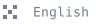

<p align="right">
  
  &nbsp;&nbsp;
  <a href="./README.en.md"></a>
</p>

<p align="center">
  
</p>

<p align="center">
  <a href="https://developer.apple.com/ios/"></a>
  <a href="https://www.swift.org/"></a>
  <a href="https://platform.xmaxai.com/"></a>
  <a href="./LICENSE"></a>
</p>

XmaxSDK 是一款面向 iOS 的原生 SDK，帮助开发者快速接入 Xmax AI 的实时交互视频生成能力。它可以根据实时画面、参考图和用户操作，低延迟地生成高保真视频。只需几行代码，即可在应用中实现实时角色替换、虚拟试穿、混合现实伙伴、交互式图片动画等功能。

## 用 XmaxSDK 可以做什么？

XmaxSDK 将媒体输入、文件传输、视频生成和画面渲染整合为一套易用的 API。你可以使用相机画面、静态图片或本地视频作为输入，通过提示词和参考图控制生成内容，还可以用触控手势实时改变画面中主体的动作。

### 实时改变视频内容

在摄像头画面或本地视频播放的同时，实时生成新的视觉内容。你可以用它实现角色替换、虚拟试穿、画面风格转换和混合现实伙伴等功能。SDK 会同时管理原始画面和生成画面的渲染，让预览与生成结果之间的切换更自然。

### 让图片跟着手势动起来

一张静态图片，也可以变成能够实时互动的动态画面。XmaxSDK 会采集用户在画面上的多点触控轨迹，并将轨迹发送给生成任务，让图片中的人物或其他主体跟随手势移动。

<p align="center"></p>

<br>

## 为什么选择 XmaxSDK？

| 低延迟 | 低成本 | 高保真 |
| --- | --- | --- |
| 针对实时交互链路做了专门优化，尽可能缩短从输入到生成画面回传的等待时间，让操作和反馈更跟手。 | 支持按需开始、更新和停止生成任务，并内置渲染、交互和存储能力，减少重复开发和不必要的生成开销。 | 改变角色、服装或画面风格的同时，尽量保留主体细节和前后帧的一致性，让生成结果更稳定、更自然。 |

<br>

## 如何使用 XmaxSDK

### 接入前准备

- iOS 15.0 或更高版本
- Swift 6
- Xmax API Key

> [!WARNING]
> 不要将 Xmax API Key 写入代码或提交到版本控制系统。建议在运行时安全地注入凭证，也可以使用 Xmax API 签发的临时 Key。详情请参阅[身份认证](https://platform.xmaxai.com/docs/authentication)。

### 安装

目前支持以下两种接入方式：

- 通过 CocoaPods 引入源码
- 从 GitHub Releases 下载并手动集成 XCFramework

1.0.3 版本暂不支持 Swift Package Manager。

#### CocoaPods

XmaxSDK 支持通过 CocoaPods 从本仓库直接引入。在应用的 `Podfile` 中添加所需的 Spec 源和 XmaxSDK 依赖：

```ruby
source 'https://github.com/volcengine/volcengine-specs.git'
source 'https://cdn.cocoapods.org/'

platform :ios, '15.0'

use_frameworks! :linkage => :static

target 'YourApp' do
  pod 'XmaxSDK',
      :git => 'https://github.com/XingMai/XmaxSDK-iOS.git',
      :tag => '1.0.3'
end

post_install do |installer|
  installer.pods_project.targets.each do |target|
    target.build_configurations.each do |configuration|
      configuration.build_settings['IPHONEOS_DEPLOYMENT_TARGET'] = '15.0'
      configuration.build_settings['EXCLUDED_ARCHS[sdk=iphonesimulator*]'] = ''
    end
  end
end
```

执行以下命令安装依赖：

```bash
pod install --repo-update
```

安装完成后，打开生成的 `.xcworkspace` 文件即可构建应用。

这里需要使用静态链接，确保 Swift 能够正常导入 Objective-C 依赖 `QCloudCOSXML`。

#### 手动集成

如需手动接入，请先下载并解压 [`XmaxSDK-1.0.3.xcframework.zip`](https://github.com/XingMai/XmaxSDK-iOS/releases/download/1.0.3/XmaxSDK-1.0.3.xcframework.zip)，然后准备与当前版本匹配的第三方依赖：

- [VolcEngineRTC `3.60.106.600`](https://hstob-cdn-tos.volccdn.com/volcengine/VolcEngineRTC/3.60.106.600/VolcEngineRTC.zip)：使用下载包中的 `VolcEngineRTC.xcframework`、`RealXBase.xcframework` 和 `RTCFFmpeg.xcframework`。
- [腾讯云 COS iOS SDK `6.5.7`](https://github.com/tencentyun/qcloud-sdk-ios/releases/download/6.5.7/QCloudCOSXML-6.5.7.zip)：使用官方发布包中的 `QCloudCOSXML.xcframework` 和 `QCloudCore.xcframework`。

将这些 Framework 添加到应用 Target 的 **Frameworks, Libraries, and Embedded Content**，并按下表设置嵌入方式：

| Framework | 嵌入设置 |
| --- | --- |
| `XmaxSDK.xcframework` | Do Not Embed |
| `QCloudCOSXML.xcframework` | Do Not Embed |
| `QCloudCore.xcframework` | Do Not Embed |
| `VolcEngineRTC.xcframework` | Embed & Sign |
| `RealXBase.xcframework` | Embed & Sign |
| `RTCFFmpeg.xcframework` | Embed & Sign |

XmaxSDK 和 COS 使用静态 Framework；三个 VolcEngine Framework 为动态库，需要由应用 Target 嵌入并签名。

完成以下配置：

1. 将 **Swift Language Version** 设为 **Swift 6**。
2. 在 **Other Linker Flags** 中添加 `-ObjC`。
3. 链接 `Accelerate.framework`、`CoreMedia.framework`、`CoreTelephony.framework`、`SystemConfiguration.framework`、`libz.tbd` 和 `libc++.tbd`。
4. 将 COS 的 [`PrivacyInfo.xcprivacy`](https://github.com/tencentyun/qcloud-sdk-ios/blob/6.5.7/QCloudCOSXML/PrivacyInfo.xcprivacy) 文件添加到应用 Target。
5. 确认每个 XCFramework 都包含目标平台和架构所需的 Slice。在 Apple 芯片 Mac 上运行模拟器时，需要 `arm64` 模拟器 Slice。

COS 只需引入 `QCloudCOSXML.xcframework` 和 `QCloudCore.xcframework`，无需添加 `QCloudTrack.xcframework`、`COSBeaconAPI_Base.xcframework` 或 QimeiSDK。由于 XmaxSDK 的 Swift 模块接口引用了 `QCloudCOSXML` 和 `VolcEngineRTC`，编译时必须能够找到这两个依赖。

### 声明隐私权限

使用相机作为输入源时，需要在应用的 `Info.plist` 中添加相机权限说明：

```xml
<key>NSCameraUsageDescription</key>
<string>此应用使用相机提供实时视频输入。</string>
```

如果本地视频包含音频，还需要添加麦克风权限说明：

```xml
<key>NSMicrophoneUsageDescription</key>
<string>此应用使用麦克风提供实时音频输入。</string>
```

请根据应用的实际用途调整文案。创建本地媒体流时，XmaxSDK 会自动检查并申请所需权限；如果用户未授权，SDK 将返回 `XmaxError`。

### 快速开始

#### 创建客户端

```swift
import XmaxSDK

let client = XmaxClient(
    configuration: XmaxConfiguration(apiKey: "YOUR_API_KEY")
)

let realtime = client.createRealtimeManager(
    options: RealtimeConfiguration(model: .x2_0)
)
```

实时相关 API 基于 Swift Concurrency。请在生命周期明确、由业务侧持有的 `Task` 中调用。

如需监听连接状态和运行错误，可以注册以下回调：

```swift
await realtime.setStateListener { state in
    print(
        "Xmax realtime state: \(state.connectionState.rawValue), " +
        "session: \(state.sessionID ?? "-"), task: \(state.taskID ?? "-")"
    )
}

await realtime.setErrorListener { error in
    print("Xmax realtime error: \(error.code.rawValue) \(error.message)")
}
```

#### 创建输入流

取得相机权限后，可以创建实时相机流：

```swift
let localStream = try await realtime.createLocalCameraStream(
    videoFormat: RealtimeVideoFormat(
        width: 704,
        height: 1280,
        fps: 24
    ),
    position: .front
)
```

除了相机，也可以使用静态图片或本地视频作为输入：

```swift
let imageStream = try await realtime.createLocalImageStream(
    fileURL: imageFileURL
)
let videoStream = try await realtime.createLocalVideoStream(
    fileURL: videoFileURL
)
```

XmaxSDK 同一时间只支持一个本地输入流。

#### 预览输入

在 UIKit 中，将本地视频流绑定到 `XmaxRealtimeVideoView`：

```swift
let realtimeVideoView = XmaxRealtimeVideoView(
    localTrack: localStream.videoTrack,
    videoContentMode: .fill
)
```

在 SwiftUI 中，使用 `XmaxRealtimeVideo` 渲染本地和远端视频：

```swift
XmaxRealtimeVideo(
    localTrack: localStream.videoTrack,
    remoteTrack: remoteVideoTrack,
    videoContentMode: .fill
)
```

#### 开始生成

创建 `RealtimeContext`，传入提示词；如果需要，也可以同时传入远程参考图地址：

```swift
let remoteStream = try await realtime.startGeneration(
    localStream: localStream,
    context: RealtimeContext(
        prompt: "视频中角色替换成参考图中角色",
        referencePath: referenceImageURL
    )
)
```

在 UIKit 中，将生成的视频轨道设置到同一个实时视频视图：

```swift
realtimeVideoView.remoteTrack = remoteStream.videoTrack
```

在 SwiftUI 中，更新 `XmaxRealtimeVideo` 使用的远端视频轨道：

```swift
remoteVideoTrack = remoteStream.videoTrack
```

`XmaxRealtimeVideoView` 和 `XmaxRealtimeVideo` 会继续在底层播放本地预览，收到第一帧生成画面后再切换到生成结果。当 `remoteTrack` 设为 `nil` 时，界面会恢复显示本地预览。

如需在 SDK 之外录制或进一步处理生成画面，请在开始生成前注册视频帧回调：

```swift
await realtime.setRemoteVideoFrameListener { frame in
    recorder.append(
        pixelBuffer: frame.pixelBuffer,
        presentationTimeStamp: frame.presentationTimeStamp,
        duration: frame.duration
    )
}
```

回调会在专用的串行后台队列中返回最终用于渲染的视频帧。开启帧插值后，返回的是插值处理后的结果。帧时间戳不一定从零开始，录制时应以收到的第一帧为基准重设时间线。建议尽快将视频帧交给录制管线，不要在回调中同步编码。目前该 API 只提供视频帧，不包含生成音频。

不再需要接收视频帧时，请移除回调：

```swift
await realtime.setRemoteVideoFrameListener(nil)
```

生成过程中，如需更换提示词或参考图，再次提交新的 `RealtimeContext` 即可：

```swift
try await realtime.startGeneration(
    context: RealtimeContext(
        prompt: "将人物服装替换成参考图中的服装",
        referencePath: anotherReferenceImageURL
    )
)
```

#### 停止并释放资源

```swift
await realtime.stopGeneration()
await realtime.disconnect()
await realtime.close()
```

`stopGeneration()` 用于停止当前生成任务，但会保留远端连接和本地预览。`disconnect()` 用于断开远端会话，同样不会关闭本地预览。整个实时流程结束后，请调用 `close()` 释放本地媒体和 RTC 资源。

### 触控交互

生成过程中，`XmaxRealtimeVideoView` 和 `XmaxRealtimeVideo` 会自动采集用户在画面上的多点触控轨迹，并发送给当前生成任务。应用无需自行处理手势追踪和坐标转换。

轨迹交互默认开启。如果外层 UI 需要接管触摸事件，可以在 UIKit 中关闭该功能：

```swift
realtimeVideoView.isInteractionEnabled = false
```

在 SwiftUI 中，通过 `isInteractionEnabled` 控制是否启用轨迹交互：

```swift
XmaxRealtimeVideo(
    localTrack: localStream.videoTrack,
    remoteTrack: remoteVideoTrack,
    isInteractionEnabled: false
)
```

### 上传参考图

`RealtimeContext.referencePath` 必须是可访问的远程图片地址。如果参考图来自本地，请先通过存储管理器上传，再使用上传后返回的 URL：

```swift
let storage = try client.createStorageManager()

let uploaded = try await storage.uploadImage(
    at: imageFileURL,
    contentType: "image/jpeg"
)

let referenceImageURL = uploaded.url.absoluteString
```

存储管理器会向 Xmax 获取临时凭证，应用中无需保存腾讯云凭证。

### 帧插值

在系统版本为 iOS 26 及以上、且硬件支持的设备上，XmaxSDK 可以对服务端返回的视频帧进行插值。该功能默认开启，也可以在运行时关闭：

```swift
try await realtime.setFrameInterpolationEnabled(false)
```

调用 `client.createMediaService().supportsFrameInterpolation(for:)`，可以检查当前设备是否支持指定视频尺寸的帧插值。

### 日志

SDK 默认不输出日志。创建客户端时，可以按需开启业务日志、性能日志，或同时开启两者：

```swift
let configuration = XmaxConfiguration(
    apiKey: "YOUR_API_KEY",
    loggerOptions: [.business, .performance]
)

let client = XmaxClient(configuration: configuration)
```

日志配置对整个进程生效，所有 `XmaxClient` 实例共用同一套设置。

<br>

## 示例工程

[`Examples/XLab`](./Examples/XLab) 中提供了一个可直接运行的示例应用，同时包含 UIKit 和 SwiftUI 两种实现。你可以在其中查看如何使用相机、图片和本地视频发起实时生成，以及如何设置提示词、选择参考图和渲染触控轨迹。

<p align="center"></p>

<br>

## 第三方依赖

- **VolcEngine RTC SDK for iOS**：负责实时音视频通信。
- **腾讯云 COS SDK**：负责通过对象存储上传和下载图片、视频。

<br>

## 联系我们

如果遇到问题或有功能建议，欢迎提交 [GitHub Issue](https://github.com/XingMai/XmaxSDK-iOS/issues)。接入咨询和技术支持请联系 [sdk@xmax.ai](mailto:sdk@xmax.ai)。

<br>

## 许可证

XmaxSDK 采用 [MIT License](LICENSE) 发布。
