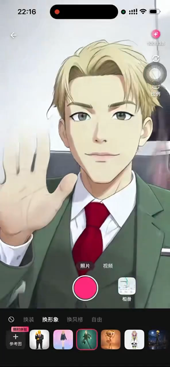
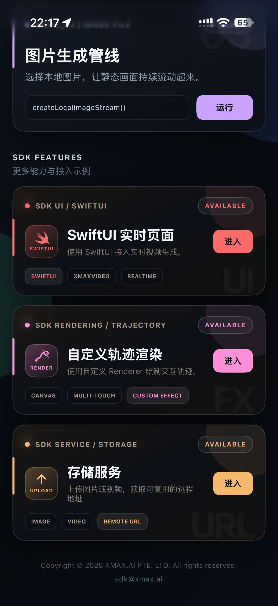
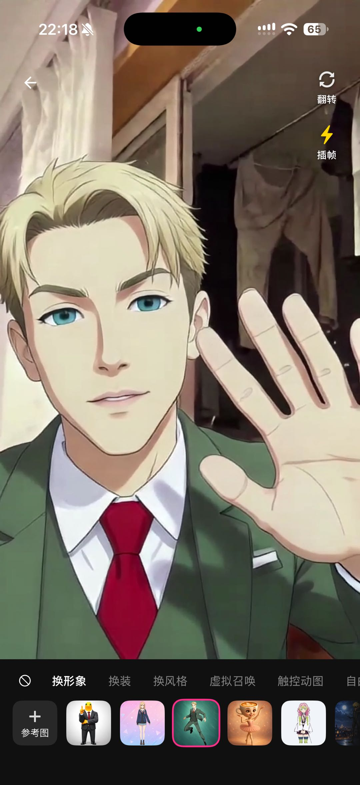

<p align="center">
  
</p>

<p align="center">
  <a href="https://developer.apple.com/ios/"></a>
  <a href="https://www.swift.org/"></a>
  <a href="https://platform.xmaxai.com/"></a>
  <a href="./LICENSE"></a>
</p>

XmaxSDK is a native iOS SDK that provides access to Xmax's real-time, interactive video
generation models. It enables low-latency, cost-efficiency, and high-fidelity video
transformations, conditioned on reference images, text prompts, and user interactions.
With concise Swift APIs, developers can integrate features such as real-time character
swapping, virtual try-on, or AI companions into iOS applications.

<p align="center"></p>

<br>

## What XmaxSDK does

XmaxSDK gives an end-to-end pipeline covering media capture, low-latency video
communication, frame-by-frame generation, and in-app rendering. Whether
processing live camera feeds, pre-recorded video, or still images, the SDK streams
input to our cloud AI engine, applies on-device enhancement to the returned video,
and renders the result. With the entire workflow abstracted into simple API calls,
integrating real-time video generation is seamless and intuitive.

<br>

## What you can build with XmaxSDK

<table>
  <tr>
    <th width="24%" align="left">Use Case</th>
    <th width="60%" align="left">Description</th>
    <th width="16%" align="center">Demo</th>
  </tr>
  <tr>
    <td width="24%" valign="middle">
      <strong>Character Swapping</strong>
    </td>
    <td width="60%" valign="middle">
      Replace anyone in your live feed with a designated avatar in real-time.
    </td>
    <td width="16%" align="center" valign="middle">
      <a href="https://cdn.jsdelivr.net/gh/XingMai/XmaxSDK-iOS@cfcee886daadc7f8b901e652361b20cd4ec42591/docs/videos/use-cases/character-swapping.mp4">
        
        <br>
        <sub>▶ Play demo</sub>
      </a>
    </td>
  </tr>
  <tr>
    <td width="24%" valign="middle">
      <strong>Virtual Try-On</strong>
    </td>
    <td width="60%" valign="middle">
      Seamlessly change outfits, preserving exact body shape, natural motion, and an
      authentic fit.
    </td>
    <td width="16%" align="center" valign="middle">
      <a href="https://cdn.jsdelivr.net/gh/XingMai/XmaxSDK-iOS@cfcee886daadc7f8b901e652361b20cd4ec42591/docs/videos/use-cases/character-swapping.mp4">
        
        <br>
        <sub>▶ Play demo</sub>
      </a>
    </td>
  </tr>
  <tr>
    <td width="24%" valign="middle">
      <strong>Video Restyling</strong>
    </td>
    <td width="60%" valign="middle">
      Reimagine your world in any style with an immersive visual experience.
    </td>
    <td width="16%" align="center" valign="middle">
      <a href="https://cdn.jsdelivr.net/gh/XingMai/XmaxSDK-iOS@cfcee886daadc7f8b901e652361b20cd4ec42591/docs/videos/use-cases/character-swapping.mp4">
        
        <br>
        <sub>▶ Play demo</sub>
      </a>
    </td>
  </tr>
  <tr>
    <td width="24%" valign="middle">
      <strong>AI Companions</strong>
    </td>
    <td width="60%" valign="middle">
      Summon virtual characters into your live camera feed and interact with them
      through gestures.
    </td>
    <td width="16%" align="center" valign="middle">
      <a href="https://cdn.jsdelivr.net/gh/XingMai/XmaxSDK-iOS@cfcee886daadc7f8b901e652361b20cd4ec42591/docs/videos/use-cases/character-swapping.mp4">
        
        <br>
        <sub>▶ Play demo</sub>
      </a>
    </td>
  </tr>
  <tr>
    <td width="24%" valign="middle">
      <strong>Live Photo</strong>
    </td>
    <td width="60%" valign="middle">
      Animate and control characters in your images simply by drawing motion
      trajectories.
    </td>
    <td width="16%" align="center" valign="middle">
      <a href="https://cdn.jsdelivr.net/gh/XingMai/XmaxSDK-iOS@d4f8a4ada6c3a30b98373d30ec7a63791f4851b1/docs/videos/use-cases/live-photo.mp4">
        
        <br>
        <sub>▶ Play demo</sub>
      </a>
    </td>
  </tr>
</table>

<br>

## Why XmaxSDK?

| <br>Low latency | <br>Cost efficiency | <br>High fidelity |
| --- | --- | --- |
| End-to-end latency is measured in hundreds of milliseconds, ensuring that updates to generation conditions and interaction controls are reflected in the stream almost instantly. | Our models run efficiently on a single NVIDIA GeForce RTX 5090 GPU, reducing inference costs by orders of magnitude compared to setups requiring high-end datacenter GPUs like the NVIDIA H100. | Our models support real-time generation at up to 1080p, delivering production-ready, high-quality video output. |

<br>

## How to use XmaxSDK?

### Before you begin

- iOS 15.0 or later
- Swift 6
- An Xmax API key

> [!WARNING]
> Do not commit an Xmax API key to version control. Supply credentials securely at
> runtime, or use a temporary key issued by the Xmax API. See
> [Authentication](https://platform.xmaxai.com/docs/authentication) for details.

### Installation

Because some of its dependencies do not support Swift Package Manager, XmaxSDK
currently supports only [**CocoaPods**](#cocoapods) and
[**manual integration**](#manual).

#### CocoaPods

XmaxSDK is distributed directly from this GitHub repository through CocoaPods. Add
the required spec sources and XmaxSDK dependency to the application's `Podfile`:

```ruby
source 'https://github.com/volcengine/volcengine-specs.git'
source 'https://cdn.cocoapods.org/'

platform :ios, '15.0'

use_frameworks! :linkage => :static

target 'YourApp' do
  pod 'XmaxSDK',
      :git => 'https://github.com/XingMai/XmaxSDK-iOS.git',
      :tag => '1.0.3'
end

post_install do |installer|
  installer.pods_project.targets.each do |target|
    target.build_configurations.each do |configuration|
      configuration.build_settings['IPHONEOS_DEPLOYMENT_TARGET'] = '15.0'
      configuration.build_settings['EXCLUDED_ARCHS[sdk=iphonesimulator*]'] = ''
    end
  end
end
```

Install the dependencies:

```bash
pod install --repo-update
```

Open the generated `.xcworkspace` file to build the application.

Static framework linkage is required so that the Objective-C `QCloudCOSXML`
dependency is exposed as a module that XmaxSDK can import from Swift.

#### Manual

Download
[`XmaxSDK-1.0.3.xcframework.zip`](https://github.com/XingMai/XmaxSDK-iOS/releases/download/1.0.3/XmaxSDK-1.0.3.xcframework.zip),
extract `XmaxSDK.xcframework`, and download the exact third-party dependencies used
by this release:

- [VolcEngineRTC `3.60.106.600`](https://hstob-cdn-tos.volccdn.com/volcengine/VolcEngineRTC/3.60.106.600/VolcEngineRTC.zip):
  use `VolcEngineRTC.xcframework`, `RealXBase.xcframework`, and
  `RTCFFmpeg.xcframework` from the downloaded archive.
- [Tencent Cloud COS iOS SDK `6.5.7`](https://github.com/tencentyun/qcloud-sdk-ios/releases/download/6.5.7/QCloudCOSXML-6.5.7.zip):
  use `QCloudCOSXML.xcframework` and `QCloudCore.xcframework` from the official
  release archive.

Add the frameworks to the application target under **Frameworks, Libraries, and
Embedded Content** using the following settings:

| Framework | Embed setting |
| --- | --- |
| `XmaxSDK.xcframework` | Do Not Embed |
| `QCloudCOSXML.xcframework` | Do Not Embed |
| `QCloudCore.xcframework` | Do Not Embed |
| `VolcEngineRTC.xcframework` | Embed & Sign |
| `RealXBase.xcframework` | Embed & Sign |
| `RTCFFmpeg.xcframework` | Embed & Sign |

The XmaxSDK and COS binaries are static. The three VolcEngine binaries are dynamic
and must be embedded and signed by the application target.

Complete the following configuration:

1. Set **Swift Language Version** to **Swift 6**.
2. Add `-ObjC` to **Other Linker Flags**.
3. Link `Accelerate.framework`, `CoreMedia.framework`,
   `CoreTelephony.framework`, `SystemConfiguration.framework`, `libz.tbd`,
   and `libc++.tbd`.
4. Add the COS
   [`PrivacyInfo.xcprivacy`](https://github.com/tencentyun/qcloud-sdk-ios/blob/6.5.7/QCloudCOSXML/PrivacyInfo.xcprivacy)
   file to the application target.
5. Confirm that every XCFramework contains a slice for the target platform and
   architecture. Apple silicon simulator builds require an `arm64` simulator slice.

Only `QCloudCOSXML.xcframework` and `QCloudCore.xcframework` are required for COS.
Do not add `QCloudTrack.xcframework`, `COSBeaconAPI_Base.xcframework`, or QimeiSDK.
The third-party frameworks must be present when importing XmaxSDK because its stable
Swift module interface imports `QCloudCOSXML` and `VolcEngineRTC`.

### Configure privacy permissions

For camera-based input, provide a camera usage description in the application's
`Info.plist`:

```xml
<key>NSCameraUsageDescription</key>
<string>This app uses the camera for real-time video input.</string>
```

If a local video input contains audio, also provide a microphone usage description:

```xml
<key>NSMicrophoneUsageDescription</key>
<string>This app uses the microphone for real-time audio input.</string>
```

Replace these descriptions with text appropriate for the application. XmaxSDK checks
and requests the required runtime permissions when a local media stream is created.
If permission is unavailable, the SDK reports an `XmaxError`.

### Build your first realtime generation experience

#### Create a client

```swift
import XmaxSDK

let client = XmaxClient(
    configuration: XmaxConfiguration(apiKey: "YOUR_API_KEY")
)

let realtime = client.createRealtimeManager(
    options: RealtimeConfiguration(model: .x2_0)
)
```

Realtime operations use Swift Concurrency and should be invoked from a
lifecycle-aware `Task` owned by the host application.

Connection-state and error listeners may be registered on the realtime manager:

```swift
await realtime.setStateListener { state in
    print(
        "Xmax realtime state: \(state.connectionState.rawValue), " +
        "session: \(state.sessionID ?? "-"), task: \(state.taskID ?? "-")"
    )
}

await realtime.setErrorListener { error in
    print("Xmax realtime error: \(error.code.rawValue) \(error.message)")
}
```

#### Create an input stream

After camera permission has been granted, create a live camera stream:

```swift
let localStream = try await realtime.createLocalCameraStream(
    videoFormat: RealtimeVideoFormat(
        width: 704,
        height: 1280,
        fps: 24
    ),
    position: .front
)
```

Still images and local video files can also be used as input sources:

```swift
let imageStream = try await realtime.createLocalImageStream(
    fileURL: imageFileURL
)
let videoStream = try await realtime.createLocalVideoStream(
    fileURL: videoFileURL
)
```

Only one local input stream may be active at a time.

#### Preview the input

In UIKit, bind the local stream to an `XmaxRealtimeVideoView`:

```swift
let realtimeVideoView = XmaxRealtimeVideoView(
    localTrack: localStream.videoTrack,
    videoContentMode: .fill
)
```

In SwiftUI, render local and remote tracks with `XmaxRealtimeVideo`:

```swift
XmaxRealtimeVideo(
    localTrack: localStream.videoTrack,
    remoteTrack: remoteVideoTrack,
    videoContentMode: .fill
)
```

#### Start generation

Construct a `RealtimeContext` with a prompt and, when applicable, a remote reference
image URL:

```swift
let remoteStream = try await realtime.startGeneration(
    localStream: localStream,
    context: RealtimeContext(
        prompt: "Replace the video character with the reference character",
        referencePath: referenceImageURL
    )
)
```

In UIKit, assign the generated track to the same realtime video view:

```swift
realtimeVideoView.remoteTrack = remoteStream.videoTrack
```

In SwiftUI, update the remote track used by `XmaxRealtimeVideo`:

```swift
remoteVideoTrack = remoteStream.videoTrack
```

`XmaxRealtimeVideoView` and `XmaxRealtimeVideo` keep the local preview active
under the generated output, wait for the first remote frame before showing it,
and restore the local preview when `remoteTrack` becomes `nil`.

To record or process the generated output outside the SDK, register a final-frame
listener before starting generation:

```swift
await realtime.setRemoteVideoFrameListener { frame in
    recorder.append(
        pixelBuffer: frame.pixelBuffer,
        presentationTimeStamp: frame.presentationTimeStamp,
        duration: frame.duration
    )
}
```

The listener receives the frames accepted by the final render pipeline, after
optional frame interpolation, on a dedicated serial background queue. Frame time
stamps do not necessarily start at zero, so a recorder should rebase its output
timeline to the first received frame. Transfer each frame to the recording pipeline
quickly and avoid synchronous encoding in the callback. This API currently exposes
video frames only; generated audio is not included.

Clear the listener when frame delivery is no longer required:

```swift
await realtime.setRemoteVideoFrameListener(nil)
```

To update an active generation task, submit a new context containing the revised
prompt or reference image:

```swift
try await realtime.startGeneration(
    context: RealtimeContext(
        prompt: "Replace the person's outfit with the reference outfit",
        referencePath: anotherReferenceImageURL
    )
)
```

#### Stop and release resources

```swift
await realtime.stopGeneration()
await realtime.disconnect()
await realtime.close()
```

`stopGeneration()` terminates the active generation task while retaining the
remote connection and local preview. `disconnect()` closes the remote session
while preserving the local preview. `close()` releases all local media and RTC
resources and should be called when the realtime workflow is no longer required.

### Touch interaction

During an active generation task, `XmaxRealtimeVideoView` and
`XmaxRealtimeVideo` capture multi-touch trajectories over the generated video and
submit them to the active task. The host application does not need to implement
gesture tracking or coordinate conversion.

Trajectory interaction is enabled by default. In UIKit, disable it when touch input
must be handled by the surrounding user interface:

```swift
realtimeVideoView.isInteractionEnabled = false
```

In SwiftUI, set `isInteractionEnabled` when constructing `XmaxRealtimeVideo`:

```swift
XmaxRealtimeVideo(
    localTrack: localStream.videoTrack,
    remoteTrack: remoteVideoTrack,
    isInteractionEnabled: false
)
```

### Upload a reference image

`RealtimeContext.referencePath` requires a remote image URL. To use an on-device
image, upload it through the storage manager and supply the resulting URL:

```swift
let storage = try client.createStorageManager()

let uploaded = try await storage.uploadImage(
    at: imageFileURL,
    contentType: "image/jpeg"
)

let referenceImageURL = uploaded.url.absoluteString
```

The storage manager uses temporary credentials obtained from Xmax. Tencent Cloud
credentials are not embedded in the host application.

### Frame interpolation

On supported devices running iOS 26 or later, XmaxSDK can interpolate remote
generated video frames. Frame interpolation is enabled by default and can be changed
at runtime:

```swift
try await realtime.setFrameInterpolationEnabled(false)
```

Check whether the current device supports interpolation for a specific video size
with `client.createMediaService().supportsFrameInterpolation(for:)`.

### Logging

SDK logging is disabled by default. Enable business logs, performance logs, or both
when creating the client:

```swift
let configuration = XmaxConfiguration(
    apiKey: "YOUR_API_KEY",
    loggerOptions: [.business, .performance]
)

let client = XmaxClient(configuration: configuration)
```

Logging configuration is process-wide and shared by all `XmaxClient` instances.

<br>

## Example Project

A runnable reference application with UIKit and SwiftUI implementations is available
in [`Examples/XLab`](https://github.com/XingMai/XmaxSDK-iOS/tree/main/Examples/XLab).
The application demonstrates realtime generation with camera, image, and local
video inputs, together with custom prompts, reference image selection, and
trajectory rendering.

<p align="center"></p>

<br>

## Third-party dependencies

- VolcEngine RTC SDK for iOS provides real-time audio and video communication.
- Tencent Cloud COS SDK provides image and video transfer through object storage.

<br>

## Contact us

For bug reports and feature requests, use
[GitHub Issues](https://github.com/XingMai/XmaxSDK-iOS/issues). For integration
questions and technical support, contact [sdk@xmax.ai](mailto:sdk@xmax.ai).

<br>

## License

XmaxSDK is available under the terms of the [MIT License](LICENSE).
